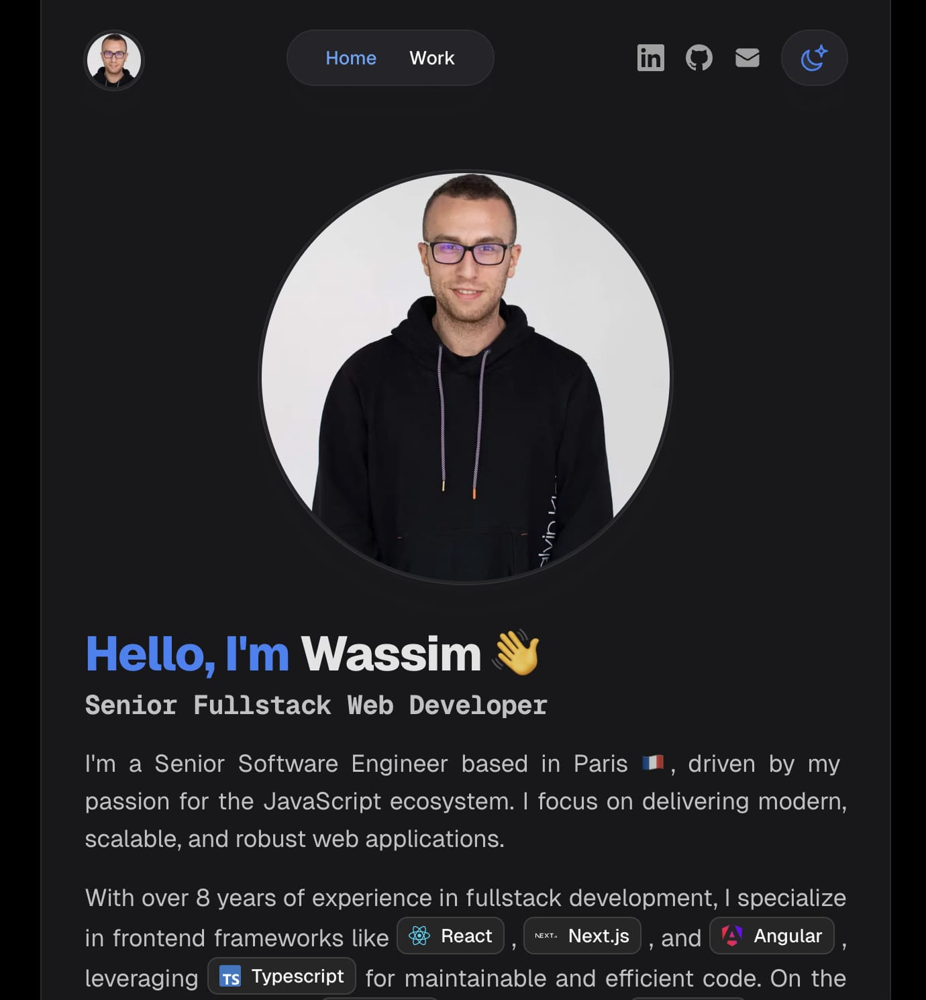

<h1 align="center">
  <a href="https://wassimbenamor.com">wassimbenamor.com</a>
</h1>
<p align="center">
  Source of my website <a href="https://wassimbenamor.com" target="_blank">wassimbenamor.com</a> built with <a href="https://nextjs.org/" target="_blank">Next</a> and hosted with <a href="https://vercel.com/" target="_blank">Vercel</a>
</p>

<div align="center">


[](https://github.com/wassim-ben-amor/site)
[](https://pnpm.io/)
[](https://nodejs.org/en/)

</div>

<div align="center">
<a href="https://wassimbenamor.com/" target="_blank"></a>
</div>

## 👋 About this repo

This is my portfolio website built with Next.js and Tailwind CSS to showcase my skills, projects, and work experiences.

## 👨‍💻 Contributing

Here is how to setup the project locally to contribute:

1. Clone the repository:
   ```bash
   $ git clone git@github.com:wassim-ben-amor/site.git
   ```
2. Install the dependencies using `pnpm` as follows:
   ```bash
   $ pnpm install
   ```
4. Run the application locally:
   ```bash
   $ pnpm dev
   ```

---

## 📦 Deploy

To deploy a new version, simply open a pull request against the `main` branch.

When this pull request will be merged, a new version will be deployed in production automatically.

---

## 📣 Author Info

- Linkedin - [@wassim-ben-amor](https://www.linkedin.com/in/wassim-ben-amor/)
- Website - [Wassim Ben Amor](https://wassimbenamor.com/)
